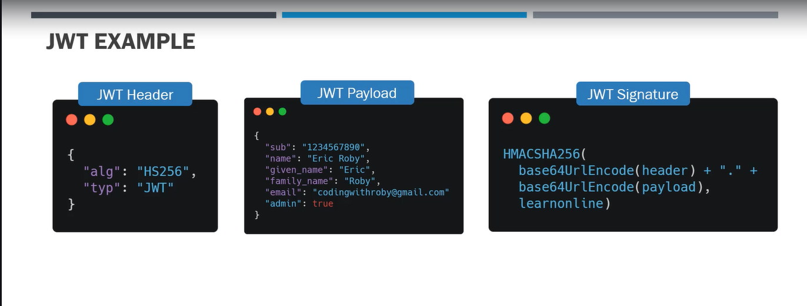

# PROJECT 3
- Focusing in TODOS
- New Information will include
  - Full SQL Database
  - Authentication
  - Authorization
  - Hashing Passwords


# Database
- Organized collection of structured information of **data**, which is stored in a computer system
- The data can be easily accessed
- The data can be modified
- The data can be controlled and organized
- Many database use a structured query language (SQL) to modify and write data
- A database allows management of the data
- Databases are organized in how the data can be retrieved, stored and modified
- There are many type of Database Management System(DBMS) : MySQL, SQLite, PostgreSQL

# SQL ***See Quel**
- Standard language for dealing with relational databases
- SQL can br use to do different things with database records:
  - Create
  - Read
  - Update
  - Delete

# Foreign Key
- A forign key is a column within a relational database table that provides a link between two seperate tables
- A foreign key references a primary key of another table
- Most relational databases need foreign keys to be able to link tables tohether to present data
  

# JWT JSON Web Token
- Json Web Token is a self contained way to securely transmit data and information between two parties using JSON Object
- JSON Web Token can be trusted because each JWT can be digitally signed, which in return allows the server to know if the JWT has been changed at all
- JWT should be used when dealing with the authorization
- JWT is a great way for information to be exchanges between the server and the client
- It is created of three seperate parts seperated by dots(.) which include:
  - Header (a) 
  - Payload (b)
  - Signature (c)\
  **```aaaaaaaa.bbbbbbbb.cccccccc```**
  
- ## JWT Header
  - A JWT header usually consist of two parts:
    - (alg) the algorithm for signing
    - "typ" The specific type of token
  - The JWT Header is then encoded using Base64 to create the first part of the JWT(a)
  - ex : 
      ```json
      {
        "alg" : "HS256",
        "typ" : "JWT"
      }
      ```

- ## JWT Payload
  - JWT Payload consists of the data. The Payloads data contains claims, and there are three different types of claims.
    - Registered : Registered claims are claims that are predefined recommended but not mandatory.The top three registered claims include is sub and exp.
ES stands for issuer.This claim identifies the principal that issued the JWT.
    - Public
    - Private
  - The JWT Payload is then encoded using Base64 to create the second part of the JWT(b)

- ## JWT Signature
  - A JWT Signature is created by using the algorithm in the header to hash out the encoded header, encoded payload with a secret.
  - The secret can be anything, but is saved somewhere on the server that the client does not have access to
  - The signature is the third and final part of JWT(c)

- 
